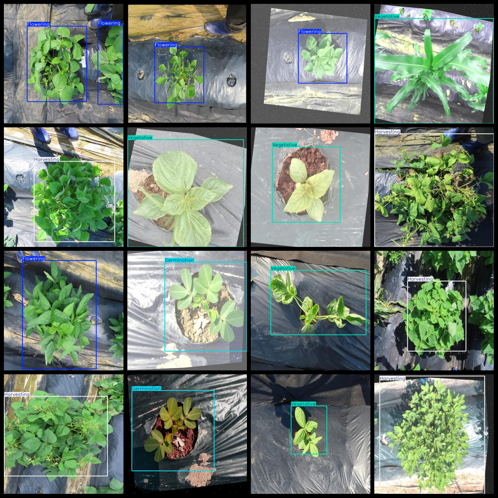
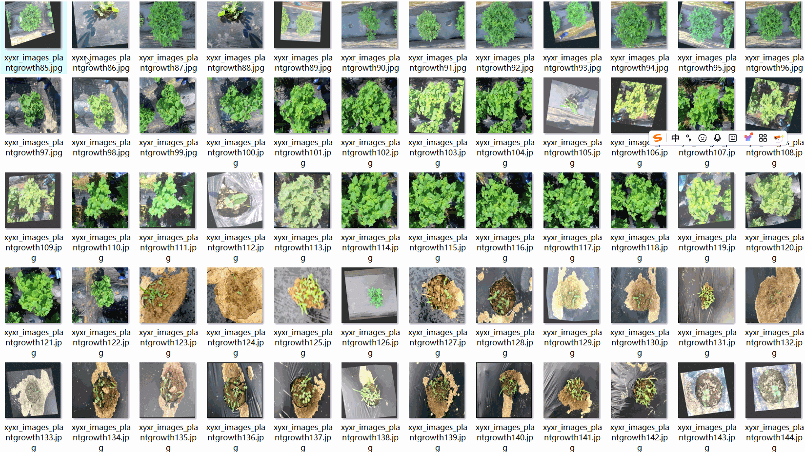

# Plant Growth Stage Detection Dataset 7264 imagesVOC+YOLO

The Plant Growth Stage Detection Dataset consists of 7264 images, organized in three folders: JPEGImages, Annotations, and labels. The JPEGImages folder contains a total of 7264 JPEG images, the Annotations folder contains 7264 XML files, and the labels folder contains 7264 txt files. The dataset is in both VOC format and YOLO format, with a compression package containing these three folders.

Each folder includes specific file types for easy reference and analysis. The JPEGImages folder contains a total of 7264 JPEG images, which are all in high resolution (pixel count). The Annotations folder has a total of 7264 XML files, while the labels folder has a total of 7264 txt files. There are 4 label categories: "Flowering", "Germination", "Harvesting", and "Vegetative". These label categories correspond to the YOLO format category order but should be verified against the classes.txt in the labels folder for accurate matching.

Here are the counts of each label category's frame numbers:

- Flowering: 2026 frames
- Germination: 1810 frames
- Harvesting: 2798 frames
- Vegetative: 1895 frames

The total number of frames is 8529. All images are at high clarity resolution (pixel count). The images have been enhanced for training purposes. The labeled shapes are all square boxes, suitable for target detection recognition.

This dataset does not guarantee the accuracy or precision of any trained models or weight files, only provides accurate and reasonable annotations. Please note that this dataset does not include any special instructions or notes.

## Images

---

Here is a pay link on Stripe (https://buy.stripe.com/3cs8yP7sY87d0vu9AB). Please contact me lonlonago@foxmail.com after funding $89, and I will send you a complete data files, thank you!

